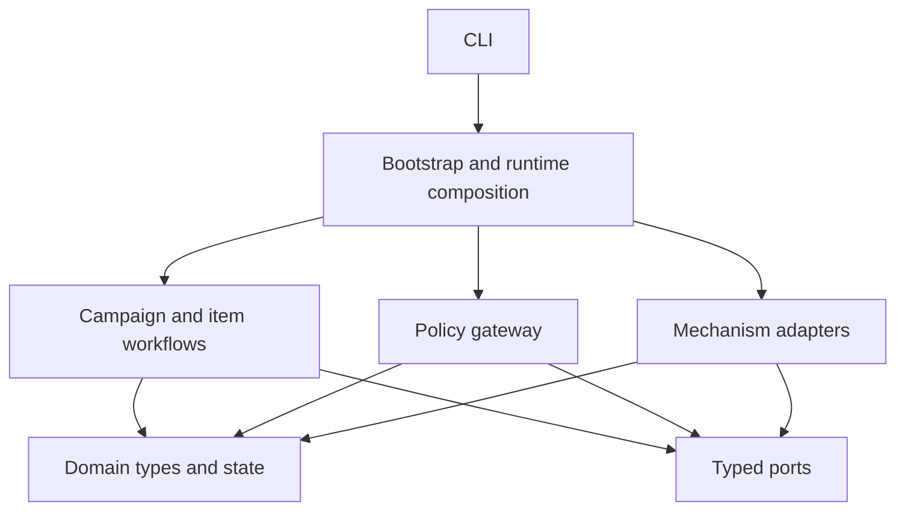
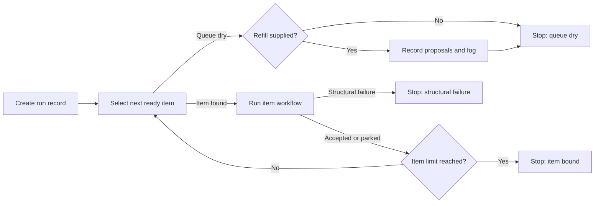

# AutoBuild architecture

This guide explains how AutoBuild keeps one build process across different coding assistants, operating systems, and trackers. It is written for readers who want to inspect, extend, or review the implementation.

The [setup and run guide](running-autobuild.md) covers installation and operation.

## Design goal

AutoBuild has one campaign sequence and one item sequence. External mechanisms sit behind typed Python interfaces called ports. Adapters implement those ports for Git, trackers, operating systems, and coding assistant commands.

The application decides what happens next. The policy layer decides whether an action is allowed. An adapter decides how to perform an allowed action.

This split keeps harness flags, shell quoting, tracker commands, and host process rules out of the workflow.

## Dependency direction



Dependencies point toward domain types and port contracts. The application layer does not import an adapter, a vendor package, `subprocess`, or platform detection.

The bootstrap package is the composition root. It is the only part that selects concrete adapters and knows which host command implementation is active.

## Package map

| Path | Responsibility |
|---|---|
| `src/autobuild/domain/` | Immutable requests, results, states, dispositions, and evidence types |
| `src/autobuild/ports/` | Protocols for each external boundary |
| `src/autobuild/application/` | Campaign loop, item workflow, prompts, and state transitions |
| `src/autobuild/enforcement/` | Deterministic policy checks around port calls |
| `src/autobuild/adapters/` | Git, tracker, harness, process, record, and knowledge mechanisms |
| `src/autobuild/bootstrap/` | Profile loading, discovery, adapter selection, and composition |
| `src/autobuild/cli.py` | Thin command-line entry point |
| `skills/autobuild-plan/` | Optional planning entry that researches, reviews and registers a queue, then stops before execution |
| `skills/autobuild/` | Optional execution entry that configures and launches the Python command |
| `tests/architecture/` | Dependency and entry-shim tripwires |
| `tests/contract/` | Shared adapter registration and result contracts |
| `tests/unit/` | Workflow and policy decisions against fakes |
| `tests/integration/` | Real processes, Git repositories, trackers, and delivery paths |

## Entry skills and executable

The Python application is the sequencing source. The `autobuild` skill supplies project facts to the command and launches it. The skill does not implement a second campaign or item workflow.

The `autobuild-plan` skill sits before execution. It researches the requested outcome, writes and reviews an end-to-end plan, and registers the resulting queue. It stops before launch unless the owner has already authorised execution.

The repository and source archive contain both skills. The wheel contains the Python application and its `autobuild` command. Skill installation remains with the coding assistant because each host owns its skill directory and loading rules.

## Runtime composition

The CLI loads `.autobuild.toml` and applies explicit command-line overrides. Bootstrap then performs these steps:

1. Choose the Windows or POSIX command adapter from the current Python host.
2. Select [Pinax](https://github.com/antikas/pinax-tracker) or the Markdown backlog adapter from `[tracker]` and startup probes.
3. Configure the Git workspace adapter with the selected tracker's paths.
4. Resolve the selected harness through the adapter registry.
5. Choose the no-refill or Koine knowledge adapter from the refill plan.
6. Probe every selected adapter before a claim.
7. Record adapter identities and versions in the run manifest.
8. Wrap the adapters with policy-enforced port implementations.
9. Start the campaign runner with one immutable `WorkflowPorts` object.

Explicit tracker and harness settings take precedence over discovery. Auto tracker selection prefers Pinax when it is usable, then checks the supported backlog path.

## Port contracts

The workflow calls seven semantic ports.

| Port | Workflow request | Included adapters |
|---|---|---|
| `TrackerPort` | Select, claim, close, park, and record a non-runnable proposal | Pinax and Markdown backlog |
| `WorkspacePort` | Identify a repository, create a worktree, calculate a diff, commit, deliver, and release | Git worktree adapter |
| `HarnessPort` | Probe, invoke a fresh seat, cancel it, and collect usage | Claude Code, Codex, and GitHub Copilot CLI |
| `CommandPort` | Run the approved validator with captured output and process-tree control | Windows and POSIX process adapters |
| `RunRecordPort` | Create a run, append events, write evidence, and complete a report | Local filesystem records |
| `KnowledgePort` | Retrieve durable context and record unresolved directions | Koine or no-refill adapter |
| `ProgressPort` | Begin a run stream and emit one plain-language line per event | File, stderr, and command hook progress adapters |

Ports exchange dataclasses and enums. Vendor JSON, command flags, and shell strings remain inside adapters.

## Campaign state

The campaign runner owns the queue loop:



Refill runs only after the live queue is dry. `ProposalRef` rejects a runnable value, so an adapter cannot feed its own proposal back into the campaign as approved work.

## Item state

One item moves through a fixed state machine:

```text
ready
  -> verified
  -> claimed
  -> isolated
  -> built
  -> validated
  -> reviewed
  -> correcting or escalated when evidence requires it
  -> finalised or parked
  -> released
```

The reviewer can return `pass`, `correct`, `escalate`, or `park`. Every finding carries a `blocking` flag. A finding is blocking only when the reviewer would not merge the change under its own name. A `correct` or `escalate` verdict must carry at least one blocking finding, a `park` verdict must carry at least one finding, and a `pass` may carry non-blocking findings only. A `pass` that carries a blocking finding, or a `correct` whose findings are all non-blocking, is an invalid verdict that the application rejects and parks. The `review.completed` event records the blocking and non-blocking finding codes separately.

A correction starts another fresh builder and reviewer pair. The default ceiling is two correction rounds. An escalation starts a specialist seat for the named specialist boundary. Any final result other than `pass` parks the item.

When a `pass` carries non-blocking findings, the application still accepts and delivers the item, then records one propose-only tracker follow-up per finding. Each follow-up uses the title `Follow-up: <item-id> <code>`, the finding consequence as its question, the reviewer evidence reference in its rationale, and `docs/campaigns/<campaign-id>.md` as its brief reference. These proposals are never runnable, and the campaign report lists them under Follow-ups.

## Evidence chain

The acceptance path binds each decision to the same workspace state.

1. `WorkspacePort.diff()` calculates changed paths, content digests, a binary patch reference, a workspace revision digest, and the branch head the evidence was taken against.
2. `CommandPort.run()` executes the declared validator in that worktree.
3. `ValidationEvidence` binds the validator result and changed paths to the workspace revision.
4. The reviewer receives the brief, patch reference, and validator output reference.
5. `commit_item()` pins the branch head: it rejects a head that moved since the recorded diff and names both the recorded and the observed head commit.
6. `commit_item()` recalculates the diff and rejects a changed workspace.
7. The product commit contains only the reviewed product paths, and a named close-completeness check confirms that the whole product tree and the item's own changed paths both report a clean status, so a close cannot ship a partial tree.
8. The tracker adapter writes the close state after the product commit.
9. The tracker commit must sit immediately after the product commit.
10. Delivery merges the item branch, pushes the default branch, and checks the remote revision.
11. After delivery the workspace confirms that the reported item, tracker, and merged commits exist and that the merged commit is reachable from the delivery target branch. A mismatch is a structural failure that stops the campaign.

The application accepts a result only when this chain remains intact. A successful model process cannot substitute for missing validator or review evidence.

Every disposition leaves a per-item trajectory file under the run record `evidence/` directory. The trajectory lists the state history, the seat outcomes, and the final reason, and it is written for accepted, parked, and failed items alike so an unaccepted item is as legible as an accepted one.

A per-item phase marker `evidence/<item-id>-phase.json` sits beside the trajectory. It is rewritten at every state transition with the state, worktree root, branch, head commit, workspace revision, correction count, and timestamp, so the head and revision each decision ran against stay pinned to disk. Its terminal value is `closed` for an accepted item, written only after the tracker commit and delivery have both been verified, or `parked` for an unaccepted one. Both terminal values are marker-only and are not item states.

## Builder and reviewer isolation

Each harness adapter starts a new command invocation with a fresh session identifier. The builder receives write-capable tools allowed by the project profile.

The reviewer receives read-only tools and a read-only sandbox when the harness supports one. Its evidence pack excludes the builder transcript.

The shared harness result contracts contain a builder summary or a review decision with concrete findings. Harness adapters normalise vendor output into these contracts.

## Git delivery model

Tracker state and product state use separate commits.

For an accepted item:

1. The tracker adapter records and pushes the claim from the primary checkout.
2. The workspace adapter creates an item branch and worktree from that claimed revision.
3. The builder changes product files in the worktree.
4. The workspace adapter excludes the selected tracker paths from the product diff.
5. It creates the product commit from the reviewed path set.
6. The tracker adapter writes the done state in the worktree.
7. The workspace adapter creates the tracker commit.
8. It merges the item branch into the default branch with `--no-ff`.
9. It pushes the default branch and verifies the remote commit.

For a parked item, AutoBuild writes and delivers a tracker-only commit. It releases the worktree without merging the unaccepted product changes.

The primary checkout must be clean before a claim and before delivery. This rule prevents AutoBuild from mixing a user's uncommitted work into a campaign.

## Tracker adapters

### Pinax

The Pinax adapter delegates ordering, readiness, dependencies, gates, and event folding to the `pinax` command. It requires `.ergon/` and an approved note reference for each selected item.

Claim, park, close, and proposal events are committed under `.ergon/`. A refill proposal receives a Pinax proposal gate and stays outside the ready queue.

### Markdown backlog

The backlog adapter parses one Markdown table with `Item`, `Title`, `Status`, and `Brief` columns. Table order is queue order.

It updates only the selected row for claim, done, and park operations. Refill adds a `Proposed` row. The Git workspace adapter treats the configured backlog file as tracker state, so it cannot enter the product commit.

Auto mode chooses a tracker once during preflight. A campaign does not move from one operational record to another after work starts.

## Policy enforcement

The policy gateway wraps every port used by the workflow. It checks:

- repository, worktree, brief, and evidence paths against approved roots
- semantic tool permissions for every harness seat
- exact validator identity and argument vector
- command and seat timeouts against configured ceilings
- reviewer read-only access
- evidence freshness before close
- separate product and tracker commits before delivery
- protected-branch gates for claim, park, proposal, and merge operations

The public workflow does not request deployment, publication, destructive actions, or force pushes.

## Host and temporary work

The Windows and POSIX command adapters accept argument vectors. The workflow does not build shell command strings.

Each adapter captures standard output and standard error in files. Timeout and cancellation stop the process tree started for that request.

Bootstrap chooses the operating system temporary directory by default. An operator can supply another scratch root. Child processes receive temporary and package cache environment variables below that root.

## Run records

The local record adapter writes one directory per campaign:

```text
runs/<run-id>/
  manifest.json
  events.jsonl
  progress.log
  evidence/
  report.txt
```

The manifest records the workflow version, repository, harness, model names, validator, refill counts, and selected adapter identities.

Events record the item lifecycle and point to evidence files. The run record keeps decision evidence and diagnostic references. It does not place a full builder transcript in the review pack.

Progress lines are rendered from those same events by a pure function in the application layer, so a line and its event payload share one source. The composite progress adapter fans each line out to its configured sinks: a file adapter that appends to `progress.log`, a stderr adapter that flushes each line, and an optional command hook adapter that forwards each line to a human-approved command. No progress adapter raises into the workflow.

## Failure handling

Preflight failures stop before a claim.

After a claim, the item workflow tries to park any builder, validator, reviewer, evidence, or adapter failure. A successful park writes the reason to the tracker and releases the worktree.

Evidence type failures mark the item as a structural failure and stop the campaign after the park. Other parked outcomes allow the campaign result to report the item honestly.

A hard process kill can interrupt cleanup. AutoBuild preserves any remaining Git branch or worktree for inspection but does not attach a new campaign to it automatically.

## Extension points

### Add a harness

Implement `HarnessPort`, use the shared result contracts, and register the adapter through the `autobuild.adapters` Python entry-point group. Add it to the shared contract and process integration tests.

The application and policy layers require no provider switch.

### Add a tracker

Implement `TrackerPort` with durable claim, close, park, and non-runnable proposal operations. Register its configuration and tracker paths in bootstrap. Reuse `GitWorkspaceAdapter` for separate product and tracker commits.

The campaign and item workflows remain unchanged.

### Add a host process adapter

Implement `CommandPort` with argument-vector execution, captured output, timeout, cancellation, and process-tree teardown. Bind it in bootstrap for the new host capability.

### Add a knowledge adapter

Implement `KnowledgePort`. Keep operational queue state in the tracker. The knowledge adapter handles durable context and unresolved directions only.

## Architecture tests

Architecture tests parse imports and fail when domain, ports, application, or enforcement point toward a forbidden outer layer. They also reject provider and host words in application logic.

Unit tests run the campaign and item state machines against fake ports. They cover acceptance, corrections, specialist escalation, park, structural failure, run bounds, and proposal-only refill.

Contract tests prove that an additional harness can register without an application change.

Integration tests use real temporary Git repositories, bare remotes, Pinax, Markdown backlog files, fake harness processes, and platform command adapters. They verify claim, separate commits, merge, push, remote revision, cancellation, path handling, and automatic backlog fallback.
